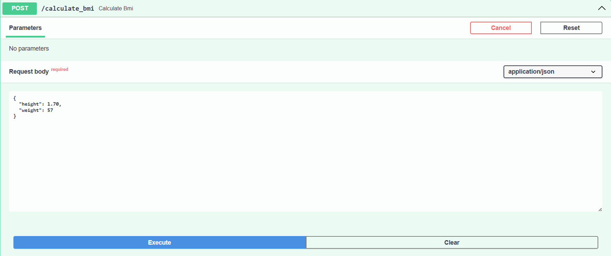
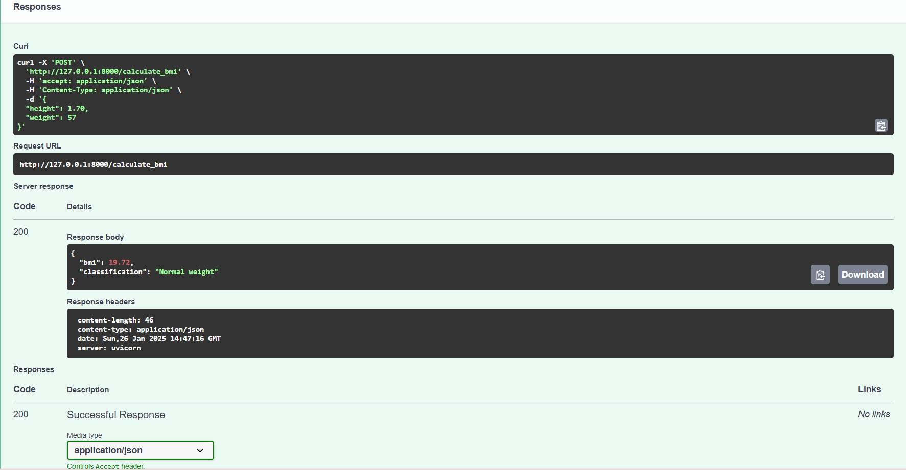

# BMI Calculator API

A simple RESTful API built with FastAPI to calculate BMI (Body Mass Index) and classify it into categories based on WHO standards.

## Features
- Accepts height (in meters) and weight (in kilograms) as input.
- Calculates BMI using the formula: `BMI = Weight (kg) / [Height (m)]²`.
- Classifies BMI as:
  - Underweight: BMI < 18.5
  - Normal weight: 18.5 ≤ BMI ≤ 24.9
  - Overweight: 25 ≤ BMI ≤ 29.9
  - Obesity: BMI ≥ 30
- Provides error handling for invalid or missing inputs.

## Setup Instructions

1. Clone the repository:
    ```bash
    git clone <repository-url>
    cd <repository-folder>
    ```

2. Create a virtual environment:
    ```bash
    python -m venv venv
    source venv/bin/activate  # On my windows: venv\Scripts\activate
    ```

3. Install dependencies:
    ```bash
    pip install fastapi uvicorn
    ```

4. Run the server:
    ```bash
    uvicorn main:app --reload
    ```

5. Access the API documentation:
    - Swagger UI: [http://127.0.0.1:8000/docs](http://127.0.0.1:8000/docs)
    - ReDoc: [http://127.0.0.1:8000/redoc](http://127.0.0.1:8000/redoc)

## Screenshot
Below are screenshots of the API's Swagger UI:



## Example Usage

### Request
`POST /calculate_bmi`

**Content-Type:**
 `application/json`

**Request Body:**
```json
{
  "height": 1.75,
  "weight": 70
}
